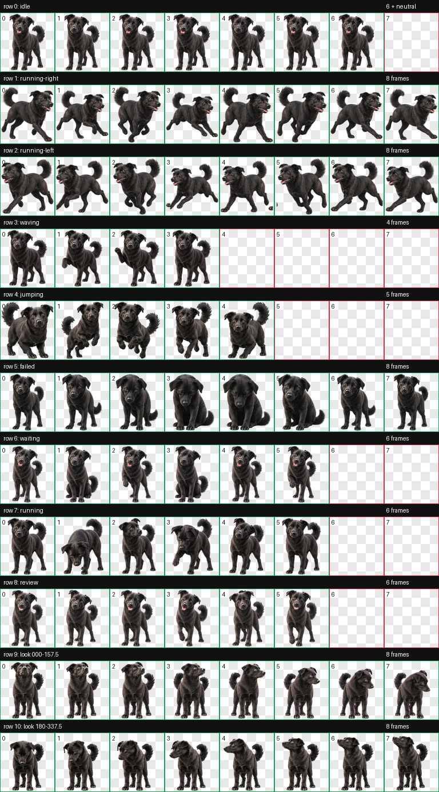
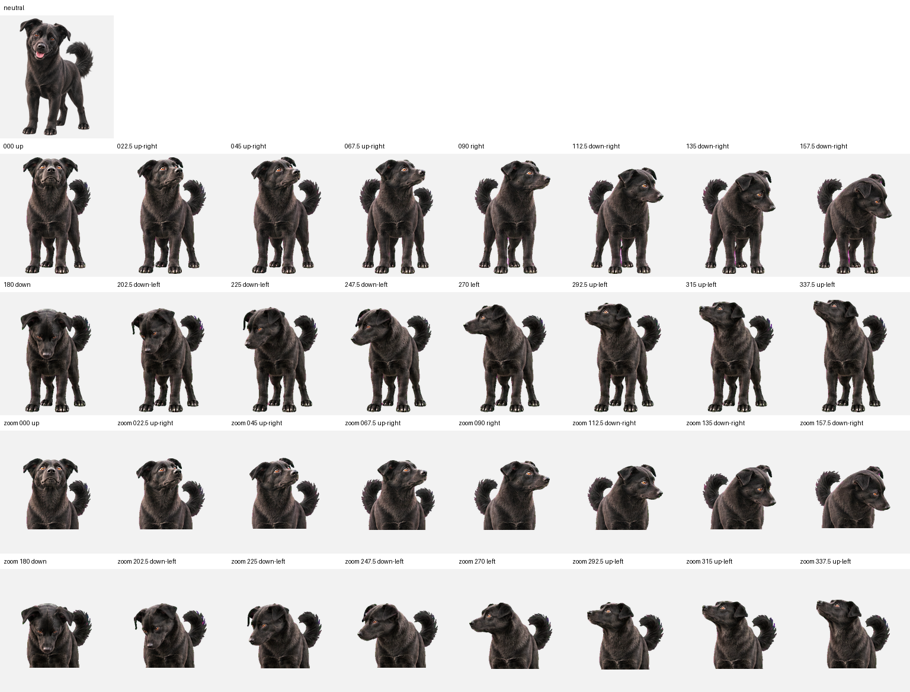

# 🐾 Momo · 会陪你工作的黑亮小狗

<div align="center">



**一个会观察、会等待、会认真工作的 Momo。**

[](https://github.com/yzhou0888-coder/zhoumomo--companion/archive/refs/heads/main.zip)
[](desktop/pet.json)
[](LICENSE)

</div>

## Momo 是谁？

Momo 来自我家真实的黑色狗狗：黑亮的毛色、温暖的琥珀色眼睛、结实的小腿，还有一条更长、更蓬松的尾巴。

它不是一个静态头像，而是一个小小的桌面伙伴：

- 💤 空闲时会坐着、趴着、放松或伸懒腰
- 👀 等待时会看向你，偶尔露出可爱的笑脸
- 💻 工作时会站起来、跑动，像是在认真处理任务
- ✨ 完成或复核时会用更明亮、更开心的表情回应
- 🧭 支持 16 个视线方向，不会永远只朝同一个角度

## 先看看它会做什么

<div align="center">



</div>

Momo 的精灵表包含 9 行动画状态，以及完整的 16 方向视线素材。每个状态都保持同一套外观：黑亮毛发、圆润的真实比例、蓬松长尾巴和自然的四肢动作。

| 状态 | 看到的感觉 | 适合的时机 |
| --- | --- | --- |
| `idle` | 安静坐着或轻微呼吸 | 默认待机 |
| `waiting` | 趴下等待、温柔注视 | 等待下一步 |
| `review` | 更有精神的笑脸 | 复核、确认 |
| `running` | 站立或小跑 | 正在工作 |
| `running-left/right` | 向左或向右移动 | 工作中的动态反馈 |
| `waving` | 主动打招呼 | 互动提示 |
| `jumping` | 开心跃起 | 完成、庆祝 |
| `failed` | 有一点失落但仍然可爱 | 需要注意或重试 |

## 🚀 一键安装

### macOS / Linux

复制到终端运行：

```bash
curl -fsSL https://raw.githubusercontent.com/yzhou0888-coder/zhoumomo--companion/main/install-momo.sh | sh
```

### Windows PowerShell

```powershell
irm https://raw.githubusercontent.com/yzhou0888-coder/zhoumomo--companion/main/install-momo.ps1 | iex
```

安装脚本会把 Momo 放到：

```text
~/.codex/pets/momo/
```

安装后重启 Codex，或重新加载宠物列表即可。

## 📦 仓库里有什么？

```text
desktop/
├── pet.json              # Codex v2 宠物清单
└── spritesheet.webp      # 完整桌面精灵图

web/
└── spritesheet.webp      # 网页/原型使用的标准精灵图

preview/
├── contact-sheet.png     # 动画总览
└── look-directions.png   # 16 个视线方向

install-momo.sh            # macOS / Linux 安装器
install-momo.ps1           # Windows 安装器
```

## 🛠️ 想把 Momo 放进自己的项目？

网页或原型可以直接使用：

```text
web/spritesheet.webp
```

桌面宠物或 Codex 兼容客户端请使用：

```text
desktop/pet.json
desktop/spritesheet.webp
```

建议保留透明背景、原始帧比例和 v2 清单信息，这样 Momo 的动作和方向映射才不会变形。

## 💛 分享说明

这个仓库是公开的，任何人都可以下载 Momo 的素材和安装器。

不过，桌面安装器适用于支持 Codex v2 pet 格式的环境；其他 GPT 客户端可以使用 `web/spritesheet.webp` 做网页宠物或自定义 UI，但不一定能直接识别桌面宠物清单。

## 📜 License

Momo 的形象基于私人宠物照片制作，仅限个人、非商业使用。你可以下载并安装到自己的 Codex 环境，但不能出售、再授权、训练模型或公开发布修改后的艺术素材。详见 [LICENSE](LICENSE)。

<div align="center">

**愿 Momo 在你写代码、思考和等待的时候，安静地陪在旁边。** 🐶

</div>
